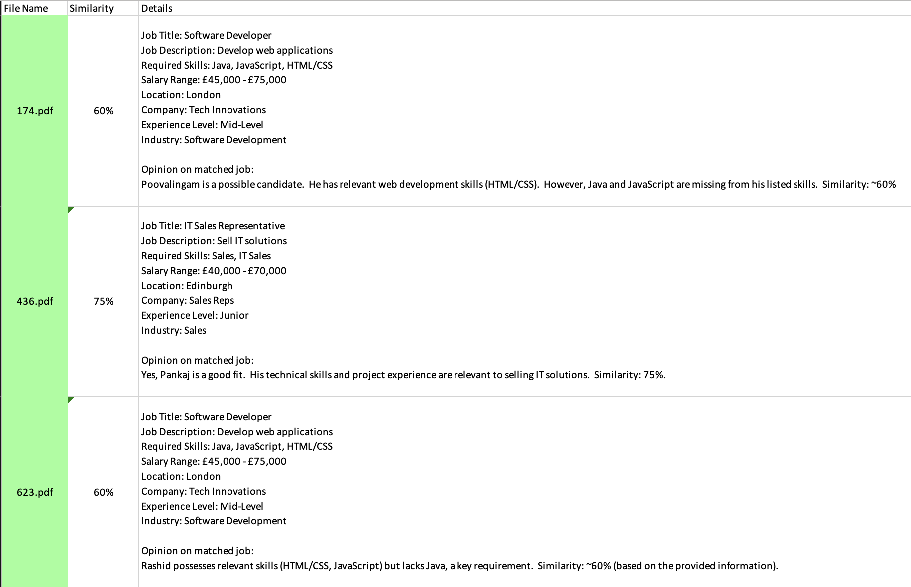

# Job Matching Application

## Overview
This project is a Python-based job matching application that processes job descriptions and resumes (CVs) to identify the most relevant opportunities. It uses state-of-the-art Natural Language Processing (NLP) techniques to extract information, generate embeddings, and compute similarities, providing an efficient and user-friendly interface for job seekers.


## Project Structure
Below is a description of the main files in the project, along with their respective paths:
- **[`src/main.py`](src/main.py)**  
  Main function to start the application.
- **[`src/pdf.py`](src/pdf.py)**  
  Provides functions to extract text from PDF files and summarize text.  
  - Key functions:  
    - `extract_text_from_pdf(pdf_path)`: Extracts text from a PDF.  
    - `summarize_text(text)`: Generates a summary for the provided text.  

- **[`src/job_matcher.py`](src/job_matcher.py)**  
  Handles job data processing, including generating and storing embeddings (**[`job_embeddings.npy`](job_embeddings.npy)**) for job descriptions, skills, and titles.
  - Key functions:  
    - `calculate_and_save_embeddings(jobs_file, output_file)`: Generates and saves embeddings.  
    - `load_embeddings(output_file)`: Loads embeddings from a specified file.
    - `check_predicted_job_similarity(cv_text, jobs_file, embeddings)`: Matches the predicted job with job descriptions.
    - `generate_opinion_details(cv_text, match_job)`: Generates opinion given the cv and the matched job.
    - `predict_job(cv_text)`: Predict the job given the cv.
- **[`src/utils.py`](src/utils.py)**  
  Defines a utility function to interact with the GEMINI API using Gemini 1.5 Flash-8B. 
  It is used to send requests with customized prompts and retrieve responses, which are processed and returned as text.
    - Key function:  
        - **`send_request_to_api(prompt)`**: Sends a POST request to the GEMINI API with the provided `prompt`.   
- **[`src/app.py`](src/app.py)**  
  Implements a GUI using PyQt6, allowing users to extract text from PDFs, generate summaries, and find matching jobs.  
  - Key features:  
    - Button to open a batch processing dialog (popup) for processing multiple PDF files, generating job similarity reports, and saving results to an Excel file.
    - File dialogs for selecting curriculum.  
    - Interactive job matching results display.
- **[`src/pop_up.py`](src/pop_up.py)**

  Implements a PyQt6-based batch processing dialog to extract text from PDFs, summarize content, and match jobs based on similarity. The dialog allows users to select input folders, specify output directories, and monitor progress through a progress bar. The results are saved in an Excel file with color-coded job similarity scores.
    - Key features:
      - Select input folder containing PDF files.
      - Specify output directory and file name for results.
      - Process PDFs, extract text, summarize content, and check job similarity.
      - Display progress bar to track processing.
      - Generate an Excel report with job matches and similarity scores.
      - Color-coding based on similarity: red (<50%), orange (50-60%), green (>=60%).

## Datasets
The project utilizes the following datasets to populate and test the job matching process:

1. **Job Opportunities Dataset**  
   The dataset for available job opportunities is sourced from Kaggle: [IT Job Opportunities Dataset (2019-2023)](https://www.kaggle.com/datasets/saurav0507/it-job-opportunities-dataset-2019-2023?resource=download).  
   This dataset **[`JobOpportunities.xlsx`](job_opportunities/JobOpportunities.xlsx)** contains job postings specifically in the IT sector. 
    
    A script **[`script_remove_duplicates.py`](job_opportunities/script_remove_duplicates.py)** is created to remove duplicate rows based on the columns `Job Title`, `Job Description`, and `Required Skills`.  
    The cleaned dataset is saved as [**`JobOpportunities_Cleaned.xlsx`**](job_opportunities/JobOpportunities_Cleaned.xlsx) file.

2. **Curriculum Dataset**  
   The dataset of curriculum vitae is obtained from GitHub: [Curriculum Vitae Dataset](https://github.com/arefinnomi/curriculum_vitae_data/tree/master).  
   An additional Python [`curriculum_vitae/script_cv_pdf.py`](curriculum_vitae/script_cv_pdf.py) script is used to filter and select resumes with an IT background, ensuring alignment with the IT job opportunities in the first dataset. 

    The relevant files are in **[`curriculum_vitae/pdf_it`](curriculum_vitae/pdf_it)** folder.


These datasets ensure relevant data is used for training and testing the matching algorithm effectively.

## Pretrained Models
This project employs two pre-trained models for specific tasks:

1. **[Gemini 1.5 Flash-8B](https://ai.google.dev/gemini-api/docs/models/gemini?hl=it#gemini-1.5-flash-8b)**  
   - **Purpose**: Summarizes curriculum vitae descriptions extracted from PDF files, predicts the job to pass to next model and generates an opinion about the cv and the matched job.

2. **[all-mpnet-base-v2](https://huggingface.co/sentence-transformers/all-mpnet-base-v2) (Sentence-Transformer model)**  
   - **Purpose**: Generates vector embeddings for job descriptions, required skills, and titles. These embeddings are used to compute similarities between curriculums and job postings, enabling accurate job matching.   
## How to Run
Set your Google AI Studio API in [`.env`](.env) file and follow these steps to set up and run the project:

1. **Install Required Libraries**
   ```bash
   pip install -r requirements.txt
2. **Run the Application**
   ```bash
   python src/main.py

## Screenshots

Below are screenshots of the application showcasing its key features.

### Main Application Interface
The main screen allows users to upload a CV in PDF format, process multiple CVs, and compare them against job offers. It displays a summary of the CV, 
identifies the best matching job offer, and provides an opinion on the matched job. 
The information shown in the screenshot refers to the file [`3170.pdf`](curriculum_vitae/pdf_it/3170.pdf).


### Process Multiple PDFs Pop-up
The batch processing pop-up allows users to process multiple CVs simultaneously. Users can select an input folder containing PDF CVs, 
specify an output directory and file name, and monitor progress using the progress bar. Additionally, a label displays the remaining processing time during execution, 
while the total execution time is shown upon completion. At the end of the process, the generated Excel file automatically opens, 
allowing users to immediately review the results. The results include job similarity scores, saved in an Excel file with color-coded scores based on similarity.

<div align="center">
  
  <br><br>
  
</div>

### Processing Report Dialog
After completing the batch processing, a dialog is displayed summarizing the results. 
It shows the total number of files processed, the distribution of similarity scores (low, medium, and high), and confirms where the [`results.xlsx`](curriculum_vitae/pdf_it/results.xlsx) file is saved.

<div align="center">
  
</div>

### Results File and Preview
The results of the batch processing are saved in an Excel file [`results.xlsx`](curriculum_vitae/pdf_it/results.xlsx).

Below is a preview of the first few rows of the generated Excel file:

